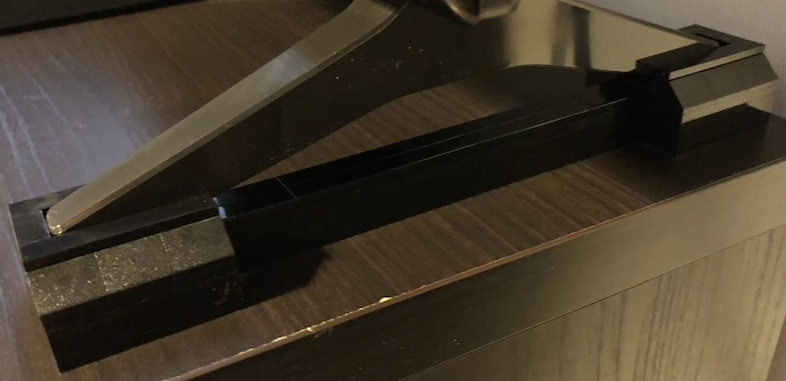
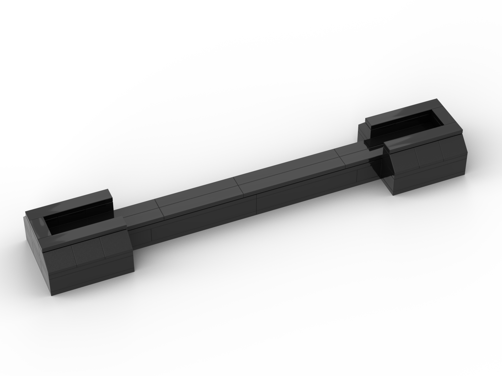
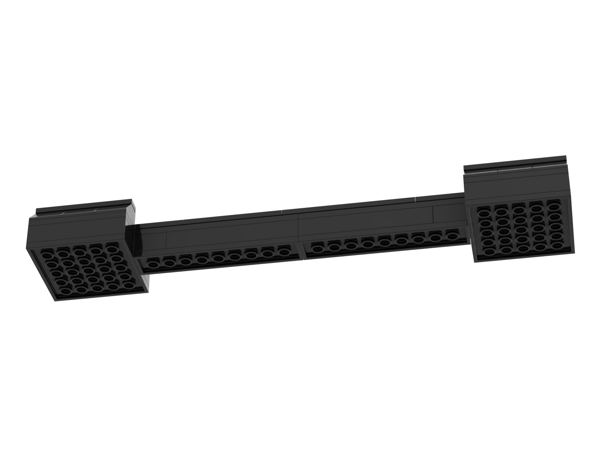

# LEGO-TV-Riser
Made for an LG 55UK6200 TV. Probably works for other models as well.

Parts: 44

Dimensions: 25,6 cm x 4,8 cm x 2,9 cm 

Weight: 91,7 g

[Download Build Steps (.pdf)](/build-steps/lego-lg-tv-riser.pdf)

[Download BrickLink Studio model file (.io)](lego-lg-tv-riser.io)

[Download BrickLink Studio](https://www.bricklink.com/v3/studio/download.page) (edit model, see parts info)

[Pick A Brick](https://www.lego.com/en-us/page/static/pick-a-brick) (order parts straight from LEGO)

# Build Steps

